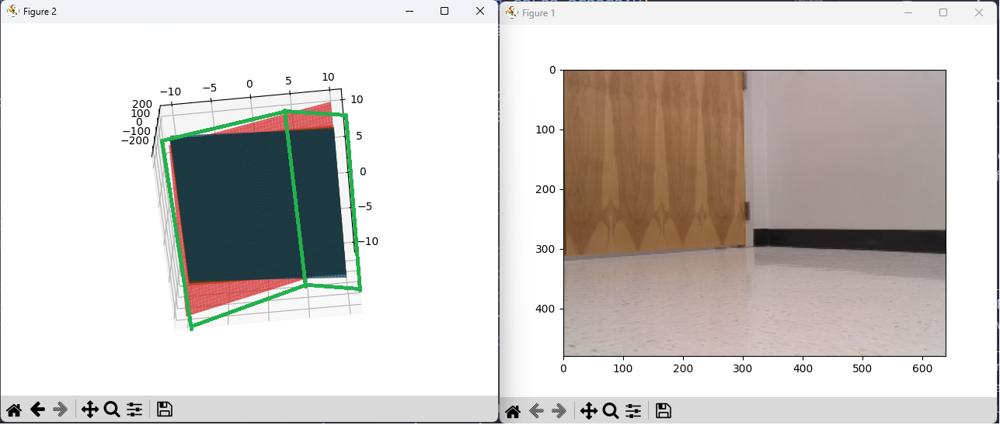

# Plane-Detection-from-Pointcloud-on-Turtlebot-4

Our objective is to detect the plane equations from a `RGBD` image.

## TODO
- Find `distance_threshold` for our RANSAC model. Currently, we are using `distance_threshold=0.8` but it creates several extra planes.
- During visualization, we need to set the range of `X` and `Y` in such a way that the plane positions and their intersection regions can be properly visualized.

As seen in the image, the model can detect some planes, but setting a proper distance parameter may discard some irrelevant plances. 

## Future Goals
- Rotate the `TurtleBot4` `RGBD` camera and take 360 view with depth information. Create a 360 planar view of the surrounding objects from the data. 